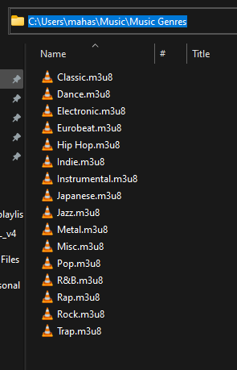

# GenreOrganizer

A tool to parse a folder's contents and organize them into a genre-based `.m3u` playlist structure.

## Usage
- Install required dependencies using `pip install -r requirements.txt`
- Run `python main.py`
<br><br>
- You can fill in the entries in the `config.json` file as follows. 
    ```json
    {
      "root_path": "C:\\Users\\mahas\\Music\\Plex Music",
      "dest_path": "C:\\Users\\mahas\\Music\\Music Genres"
    }
    ```

- Or you can leave the `config.json` as an empty dictionary 
and fill in the entries when the program asks you to. 

## Notes
- `root_path` is the root directory of all music you want to organize. 
It looks for music inside any sub-folders too. 
- `dest_path` is the directory you want to put the organized music playlists into.
    For example, if I select `C:\Users\mahas\Music\Music Genres` as my destination folder, the output will be as follows.
- 
    

## Credits
- The wikipedia page for the [Extended M3U Specification](https://en.wikipedia.org/wiki/M3U).
- Friends of mine, for testing on various media players whether the generated playlists work. 
